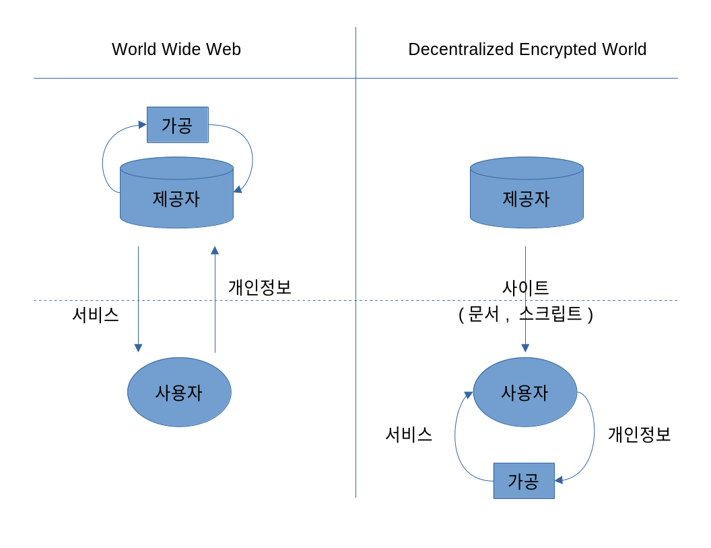

# DEW 프로젝트
**D**ecentralized **E**ncrypted **W**orld

## 배경
### World Wide Web의 성장과 그로 인한 부작용.
1. 광범위한 개인정보 수집과 유출.[^1]
2. 사용자 증가에 따른 서버 운용비용 증가.[^2]
[^1]: https://en.wikipedia.org/wiki/List\_of\_data\_breaches/
[^2]: https://www.forbes.com/advisor/business/software/how-much-does-a-website-cost/

## 프로젝트의 목적
1. 사용자의 개인정보 유출 위험을 최소화.
2. 사이트 제작 비용을 최소화해 사이트 제작 활성화.

## 각 목표 달성을 위한 접근 방법
### 개인정보 유출 위험 최소화
- 사용자 개인정보를 사용자 디바이스에 저장. 사용자 이외에는 개인정보에 접근 불가능.
- 정보 가공 또한 사용자 디바이스의 연산 장치를 이용. 정보 가공 방법이 정의된 스크립트 언어를 서비스 제공자로부터 받아와 사용자 디바이스에서 실행.

### 사이트 구축 비용 최소화
- P2P 네트워킹을 통한 사이트 공유. 사이트를 즐겨찾기 할 경우 사용자의 디바이스에 해당 사이트의 복사본을 저장. 다른 사용자로부터 요청이 들어왔을 때 해당 사용자에게 사이트를 제공.

## 기술적 차이와 장점
### 데이터 처리 방식 비교
  
그림에서와 같이 World Wide Web의 경우, 사용자의 개인정보를 서버에서 가공하기 때문에 서버를 겨냥한 크래킹이나 악의적인 내부자에 의해 사용자의 개인정보가 유출되거나 악용될 가능성 있다.
반면 Decentralized Encrypted World의 경우, 사용자의 개인정보를 사용자의 디바이스에 저장 및 가공하기 때문에 사용자 디바이스에 직접 접근하지 않는 이상 개인정보를 악용할 가능성이 현저히 적다.

### 기술적 장점
나아가 사이트 제공자가 사용자의 개인정보를 관리하지 않기 때문에 제공자가 사이트를 가지고 있어야할 필요성이 없다. 
그러므로 제공자는 사이트를 여러 다른 제공자들에게 공유하여 자신의 디바이스에 가해지는 네트워킹 트래픽을 분산시킬 수 있다.
그리고 사용자의 입장에선, 기존 W3를 사용할 때 (D)DoS 공격에 의해 서버가 다운되면 해당 서버에서 제공하던 사이트를 제공받지 못했던 반면,
DEW의 경우 서비스 제공자의 수가 많기 때문에 사이트를 다른 제공자로부터 받을 수 있다.

## 기대 효과
- 개인정보 유출 가능성이 거의 사라짐.
- 서버 컴퓨터를 구축할 필요성이 사라져 누구나 쉽게 개인 사이트를 만들고 운영 가능.
- 즐겨찾기 한 사이트의 경우 인터넷 연결 없이도 빠르게 불러올 수 있음.
