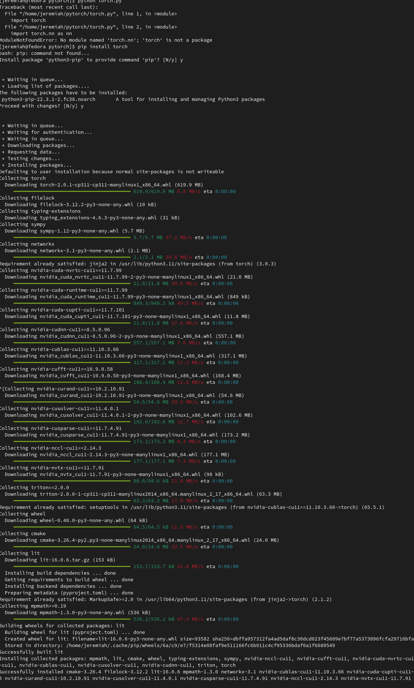
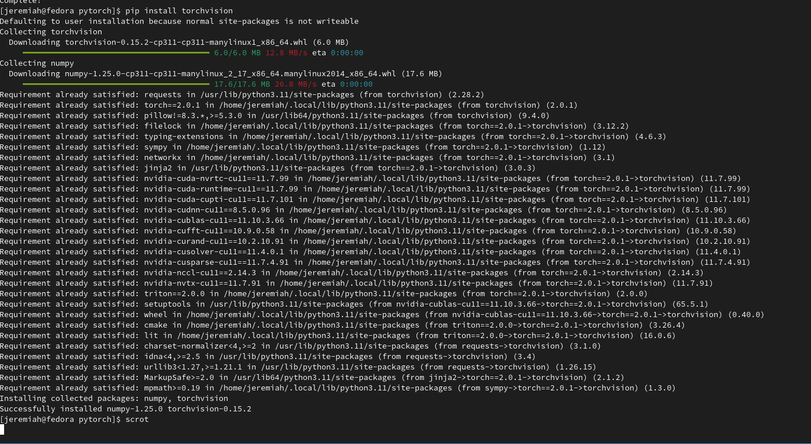
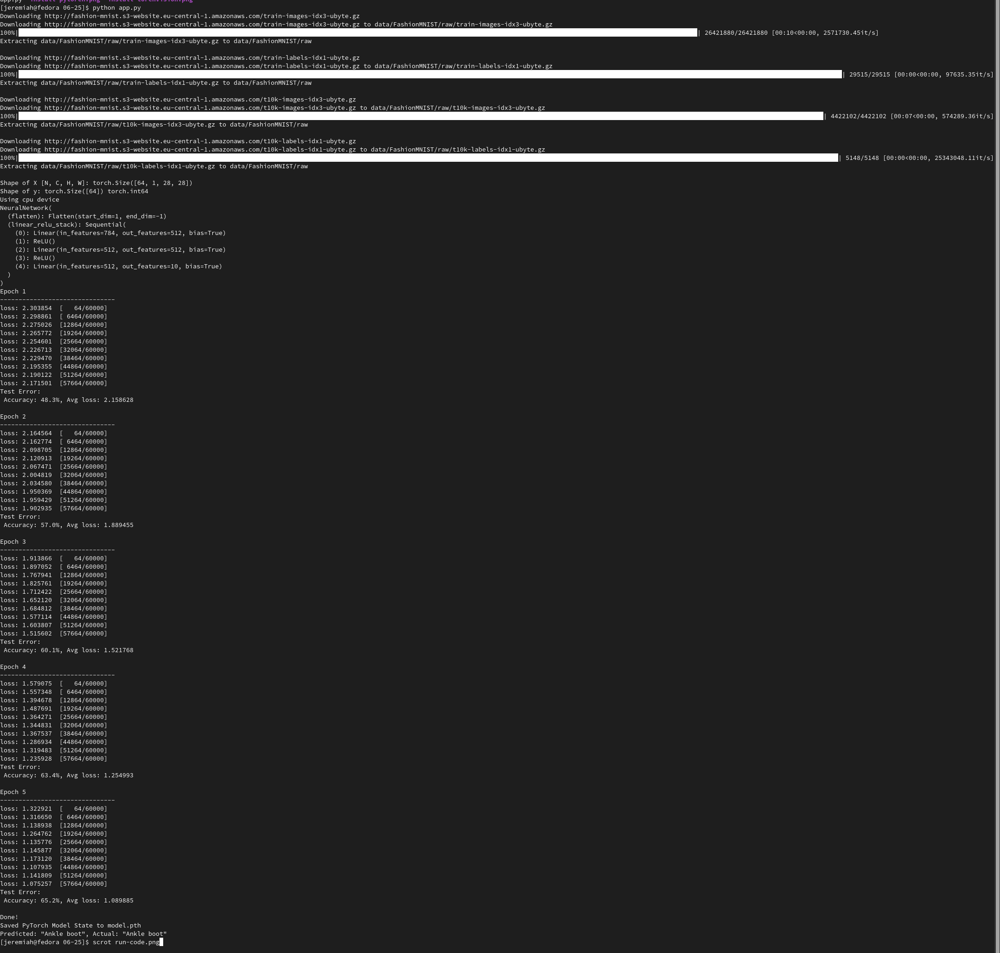

# Learn PyTorch

## Setup

Assume you already have python in your machine.  
  
Write following commands in terminal.  
`pip install pytorch`  
This command install pytorch library.  

  
`pip install torchvision`  
This command install torchvision library. this library does followings.
    1. Load datasets and data.
    2. Data transforms.
    3. Image process.
    4. detect object and segement it.
In this code we'll use feature number 1 and 2.  

## Run

Let's run some code.  
Since I'm studing so I'm gonna use tutorial code from [pytorch github](https://github.com/pytorch/tutorials/blob/main/beginner_source/basics/quickstart_tutorial.py). Copy the code, and make a file named 'app.py' and paste it.  
And run following command in terminal.  
`python app.py`  
It will show this:  

