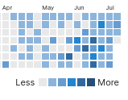

# 7월 활동 보고

## 밑바닥부터 시작하는 딥러닝
[책에 나온 소스코드들은 깃헙에 다 있다.](https://github.com/WegraLee/deep-learning-from-scratch/)
챕터 2 ~ 4. (챕터 1은 파이썬 기본 문법이라 생략)

### 챕터 2 - 퍼셉트론
NAND 게이트를 이용해서 XOR을 제외한 bitwise operation들을 구현할 수 있다는 내용.  
XOR은 불가능하기 때문에 층을 쌓아 만들어야한다는 내용.  

무슨 소리인지는 알겠으나, 이걸 왜 설명하는지 도통 모르겠는 챕터.  

### 챕터 3 - 신경망 구축
numpy의 dot연산을 중심으로 신경망 구축하는 방법.
활성화 함수 ReLU, 시그모이드 구현 방법.

신경망 구축을 중점으로 함.

### 챕터 4 - 신경망 학습
구축한 신경망을 학습시키는 내용. 손글씨 학습을 이용함.

## 개인 프로젝트

